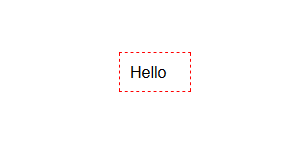
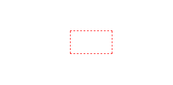
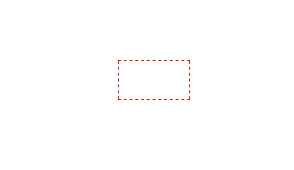

# slate-instant-replace

[](https://travis-ci.org/enzoferey/slate-instant-replace)

A Slate plugin that gives you full power on the last word your user typed.

⚠️ This package is compatible with `<= slate@0.47`, please open an issue if you are working on `>= slate@0.50` ⚠️

#### Why ?

I was looking at some plugin to automatically replace some text at the very same moment that you press the key that completes the word you want to replace. There is already a SlateJS [auto replace plugin](https://github.com/ianstormtaylor/slate-plugins/tree/master/packages/slate-auto-replace), however you need to specify a key to trigger the replacement and this key cannot be a part of the replaced text.

#### How ?

This plugin applies your transformations every time you write a new letter and has no opinion on the changes you make to the SlateJS's `editor` instance. Your transformation functions will receive as arguments the editor instance and the last word write and the rest is up to you !

## Install

```sh
npm install --save slate-instant-replace
yarn add slate-instant-replace
```

## Usage

```jsx
import InstantReplace from "slate-instant-replace";
import { Editor } from "slate-react";

const YourFunction = (editor, lastWord) => {
  ...
}

// Add the plugin to your set of plugins...
const plugins = [InstantReplace(YourFunction)];

// And later pass it into the Slate editor...
<Editor
  ...
  plugins={plugins}
/>
```

#### Multiple transforms

You can also apply a set of multiple replacement functions, in that case the argument needs to be an array of functions like (in which case the function will be applied in the same order you write them):

```jsx
const plugins = [InstantReplace([YourFunction1, YourFunction2, YourFunction3])];
```

## Options

| Option          | Type                           | Description                                                                                                                                                                         |
| --------------- | ------------------------------ | ----------------------------------------------------------------------------------------------------------------------------------------------------------------------------------- |
| **`transform`** | `Function` `ArrayOf(Function)` | The transforms to apply to the `change` object each time a letter is pressed. If an array is passed, the functions will be applied from the first element of the array to the last. |

## Commands and queries

Additionally this plugins exposes the follow [commands and queries](https://docs.slatejs.org/v/v0.47/guides/commands-and-queries) if you want to reuse them for your other plugins:

| Name                    | Type      | Description                                                                       |
| ----------------------- | --------- | --------------------------------------------------------------------------------- |
| getSelection            | `query`   | Returns the current selection.                                                    |
| getCurrentWordOffset    | `query`   | Returns the offset of the current word in the node.                               |
| getLastWord             | `query`   | Returns the last word using as a reference the current anchor position.           |
| getPreviousNode         | `query`   | Returns the previous node to the one currently focused.                           |
| isFirstCharOfNode       | `query`   | Returns true if the anchor is at position 0 of the current node.                  |
| focusPreviousInlineNode | `command` | Focuses the previous [`Inline`](https://docs.slatejs.org/v/v0.47/slate-core/inline) node. |

Commands and queries get automatically attached to the `editor` instance. This means you can use them like this:

```js
editor.getSelection();
editor.focusPreviousInlineNode();
```

## Examples

- Emoji auto replacement ([check source code](https://github.com/enzoferey/slate-instant-replace/blob/master/examples/emojis-example/src/Slate.js))



- URL inline-node auto insert ([check source code](https://github.com/enzoferey/slate-instant-replace/blob/master/examples/urls-example/src/Slate.js))



- Multiples transforms (hello => hi + emoji auto replacement) ([check source code](https://github.com/enzoferey/slate-instant-replace/blob/master/examples/multiple-transforms-example/src/Slate.js))


